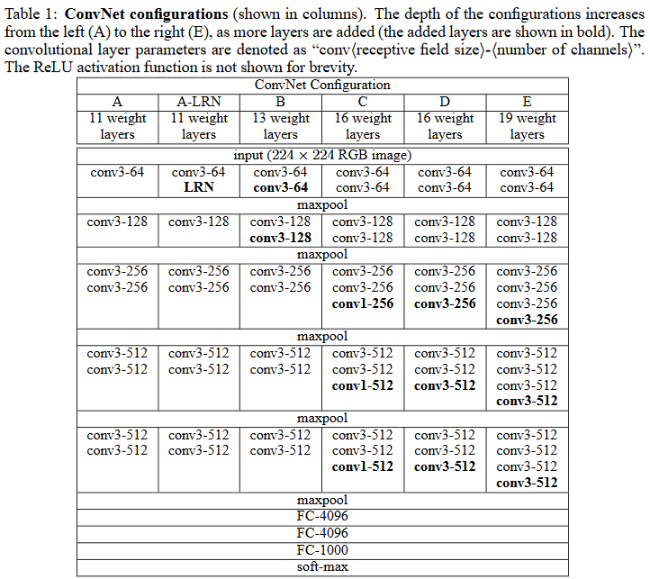
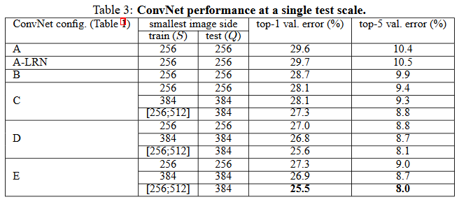
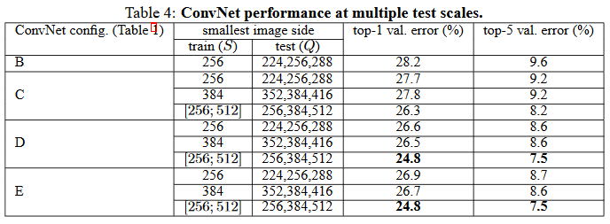
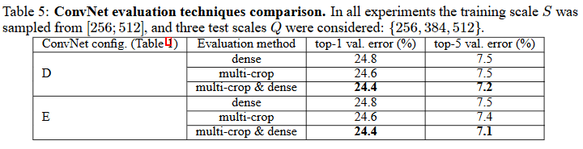
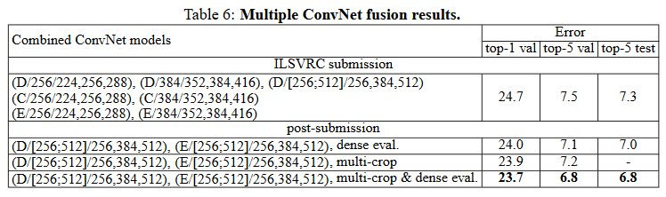

# VGGNet论文详解

## 摘要

本文研究的主要问题在于利用**非常小的卷积核（3*3）**对**推进神经网络的深度**进行了彻底的研究，这些发现是 2014 年 ImageNet 挑战赛的基础，分别在定位和分类领域获得了第一名和第二名。此外研究对于小数据集也具有泛化性。

## 1 任务背景

随着AlexNet在大规模图像识别领域获得了巨大的成功，研究人员也做出了许多尝试来改进AlexNet的结构。主要有以下两点尝试：

1. 使用更小的感受野窗口和更小的卷积步长（Zeiler & Fergus, 2013; Sermanet et al., 2014）
2. 训练和测试使用整张图的不同尺度（Sermanet et al., 2014; Howard, 2014）

而在本文中，作者则考虑了另一个卷积神经网络的重要方面：**深度**。通过增加卷积层的层数来增加卷积神经网路的深度，同时在卷积层中使用更小的卷积核（3*3）。

## 2 ConvNet配置

### 2.1 Architecture

数据预处理：

1. 在训练集上，对于每一个像素，RGB减去整个图像RGB的均值。这个操作的目的是“零中心化”，标准化图像数据，这个操作在AlexNet中也有使用。

卷积层：

1. 使用了较小的卷积核（3\*3）和（1\*1）
2. 卷积步长为1
3. padding为1像素以保证在经过3\*3的卷积后feature map的尺寸不变

池化层：

1. 最大池化，池化窗口大小为：2\*2，池化步长为2
2. 注意不是所有卷积层之后都跟着Max-pooling层

全连接层：

1. 三层全连接层，通道数分别为4096、4096、1000
2. 全连接层最后喂给softmax

其他：

1. 所有的隐藏层后跟着ReLu激活函数
2. 不再使用AlexNet的LRN技术，作者提到LRN没有提升表现，反而导致内存的消耗以及计算时间的增加

### 2.2 Configuration

配置如图所示，仅在深度上有所不同：从网络 A 中的 11 个权重层（8 个卷积层和 3 个 FC 层）到网络 E 中的 19 个权重层（16 个卷积层和 3 个 FC 层）。**尽管深度很大，网络的参数量仍然比较大卷积核较浅深度的网络参数少。**

### 2.3 Discussion

1. 为什么使用3\*3的卷积核？

   > First, we incorporate three non-linear rectification layers instead of a single one, which makes the decision function more discriminative. 
   >
   > Second, we decrease the number of parameters: assuming that both the input and the output of a three-layer 3 × 3 convolution stack has C channels, the stack is parametrised by $3 (3^2C^2) = 27C^2 $weights; at the same time, a single 7 × 7 conv. layer would require $72C^2 = 49C^2 $parameters, i.e. 81% more.

   2个3\*3的感受野相当于一个5\*5的感受野，3个3\*3的感受野相当于一个7*7的感受野（计算特征图大小变化可知），而**多个卷积有多个非线性层（激活函数）**，解释能力更强，此外**参数更少**。

2. 为什么使用1\*1的卷积核

   1\*1的卷积核在不影响卷积层感受野大小的情况下增加了非线性性。

   其实1\*1的卷积核还可以用作升维或降维，但是本文作者使用的场景是在输入通道和输出通道相同的基础上，因此不存在升维或者降维。

## 3 Classification Framework

### 3.1 Training

训练类似于AlexNet的训练，除了**多尺度训练**（后续会提到）

- 优化方法：带动量（momentum）的小批量梯度下降
- batch size：256
- learning rate：0.01
  和AlexNet一样，当val-acc 不下降则学习率缩小十倍，训练过程缩小了三次
- momentum：0.9
- weight decay：$5×10^{−4}（L_2惩罚）$
- dropout rate（前两个全连接层）：0.5
- 目标函数：多项式逻辑回归（SoftMax）
- 迭代次数：37万次iteration（74 epochs）后，停止训练

尽管相比于AlexNet，VGG具有更多的参数和更深的网络，VGG收敛需要的epoches比AlexNet更少，作者认为原因有以下两点：

1. 更大的深度和更小的卷积核所施加的隐式正则化
2. 网络权重的初始化很重要，因为糟糕的初始化可能会由于深度网络中梯度的不稳定而导致学习停滞。为了解决这个问题，作者采取的训练策略是：先训练浅层的神经网络，然后利用训练得到的参数作为深层神经网络的前几层和后几层初始化（中间层随机初始化）

**训练图像的尺寸**

为了获得固定大小的 224×224 ConvNet 输入图像，它们是从重新缩放的训练图像中随机裁剪的（每次 SGD 迭代每个图像一次裁剪）。为了进一步增强训练集，再见后的图像经历了随机水平翻转和随机 RGB 颜色偏移，这两点也是在AlexNet中学到的。

解释如下：

S代表图像的最小边，它可以根据图像的大小和内容在一定范围内变化，以捕捉不同尺寸和特征的物体。这有助于ConvNet学习更广泛的特征和物体大小。

作者考虑了两种设置训练尺寸的方法：

1. 固定训练尺度：所有的训练图像都将以相同的S值进行裁剪
2. 多尺度训练：对每个图像进行独立的重新缩放，随机选择S的值（在[Smin, Smax]之间）。这意味着每个训练图像可以在不同的尺度下进行训练

### 3.2 Testing

**Dense Evaluation：**

**首先，输入图片被rescale到一个预定义的最小尺度Q**（也称为测试尺度），Q不必与训练尺度S相等（在4中我们将介绍，对于每个S，采用几个不同的Q会提升表现。）。

**其次，将网络转化成全卷积神经网络**：

1. FCN：全连接层依次变为 1 个conv7x7，2 个 conv1x1，也就是三个卷积层。改变之后，整个网络由于没有了全连接层，网络中间的feature map不会固定，所以网络对任意大小的输入都可以处理
2. 最后一层在通道上对feature map做sum pooling然后再喂给softmax

> Since the fully-convolutional network is applied over the whole image, there is no need to sample multiple crops at test time (Krizhevsky et al., 2012), which is less efficient as it requires network re-computation for each crop. 
>
> At the same time, using a large set of crops, as done by Szegedy et al. (2014), can lead to improved accuracy, as it results in a finer sampling of the input image compared to the fully-convolutional net. Also, multi-crop evaluation is complementary to dense evaluation due to different convolution boundary conditions: when applying a ConvNet to a crop, the convolved feature maps are padded with zeros, while in the case of dense evaluation the padding for the same crop naturally comes from the neighbouring parts of an image (due to both the convolutions and spatial pooling), which substantially increases the overall network receptive field, so more context is captured. 

这一段比较了dense evaluation和AlexNet中提到的multi crop evaluation，multi crop evaluation是对进行尺度变换后图片进行多次的裁切作为网络的输入，而后再取平均值。
**multi crop evaluation是对dense evalution的很好的补充，能带来准确率的提升，但也会增加计算的负担**

## 4 Classification Experiments

**数据集**： 1000 个类别的ILSVRC-2012数据集（Large Scale Visual Recognition Challenge），其中：

- 训练集：130万张图片；
- 验证集：5万张图片；
- 测试集：10万张图片，这组数据的label没有给出（with held-out class labels）。

两个性能评估准则：top-1 和 top-5 error。前一个是多类分类错误率，错分的图像的比率。后一个是ILSVRC中主要的评估指标，计算的是预测出来的top5的类别里没有ground truth的比率，即top-5 error。

#### 4.1 Single Scale Evaluation

对每个网络（A、A-LRN、B、C、D、E）进行单独评估，测试图像尺寸依训练时的尺寸设定分为两种情况：

1. 训练图像的尺寸S固定时，设置训练图像尺寸S等于测试图像尺寸Q；
2. 训练图像尺寸S是介于$[S_{min},S_{max}]$时，设置测试图像尺寸$Q=0.5(S_{min}+S_{max})$

实验结果如下图所示：

**实验结论:**

1. 由A与A-LRN的对比：局部响应归一化LRN无效
2. 分类误差随着 ConvNet 深度的增加而减小
3. 由C与D的对比：额外的非线性函数和**较大的感受野**捕获上下文都很重要
4. **多个小卷积核的堆叠比有同样感受野规模的大卷积性能好**
5. **通过尺度抖动来增强训练集确实有助于捕获多尺度图像统计数据**

### 4.2 Multi-Scale Evaluation

现在在测试时评估尺度抖动的效果。

首先将同一张测试图像根据不同的Q值进行rescale，然后送入模型，最后将**结果平均输出**。

- 用固定大小的尺度S训练的模型，用三种尺寸Q去评估，其中$Q=[S-32,S,S+32]$
- 用尺度S随机的方式训练模型，$S∈[Smin,Smax]$，评估使用更大的尺寸范围$Q=\{S_{min},0.5(S_{min}+S_{max}),S_{max}\}$

**实验结论：**测试时的尺度抖动会带来更好的性能

### 4.3 Multi-Crop Evaluation

对比了dense evaluation以及multi-crop（多个crop输出取平均）的效果。同时我们也将这两种方法进行组合，评估效果。可以看出，使用multi-crop比dense evaluation好一点点，两种方法组合也确实取得了更好的效果，但是计算量增加较多。

### 4.4 ConvNet Fusion

多模型融合是基于多个网络softmax输出的结果的平均，该方法在AlexNet和OverFeat中也有用到。

## 5 Conclusion

研究表明，深度有利于提高分类精度，并且在ImageNet挑战数据集上，使用深度大幅增加的传统ConvNet架构可以实现最先进的性能。
